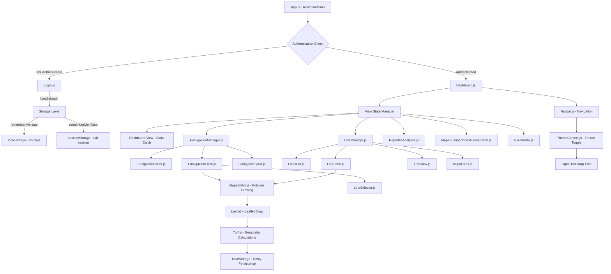
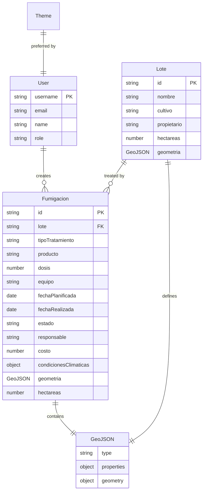
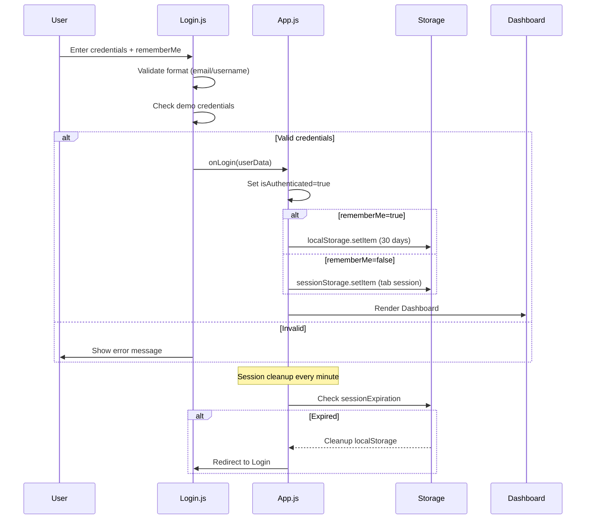
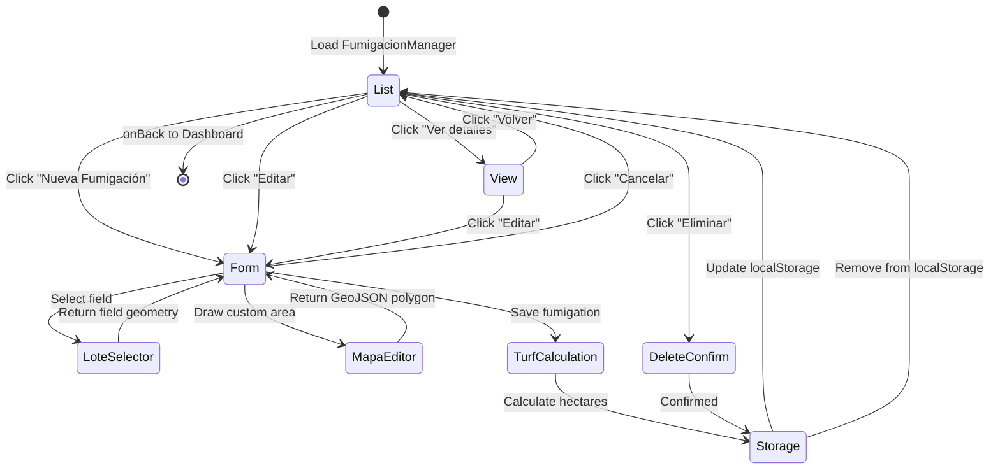
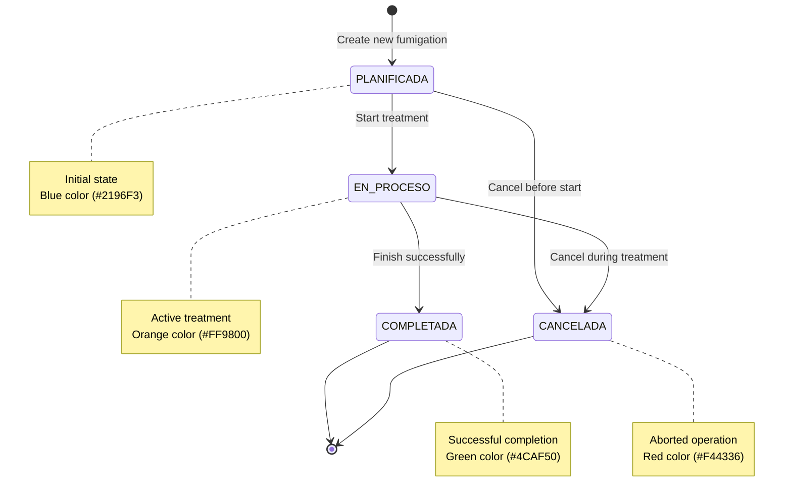

# Technical Analysis Report - Fumig App (AgriControl Pro)

**Report Date:** November 27, 2025  
**Repository:** fumigation-management-system  
**Current Branch:** docs/enhance-documentation-audit-fixes  
**Analysis Type:** Full Repository Technical Assessment

---

## 1. Project Summary

### What the Project Does

**Fumig App** (also branded as **AgriControl Pro**) is a comprehensive **React-based Single Page Application (SPA)** designed for professional agricultural fumigation management. The system digitalizes and optimizes the complete fumigation workflow from planning to post-treatment analysis.

### Problem It Solves

- **Paper-based inefficiency**: Replaces manual record-keeping of fumigation activities
- **Lack of geospatial awareness**: Provides interactive mapping for field visualization and treatment area calculation
- **Poor traceability**: Centralizes fumigation history and treatment effectiveness
- **Data-driven decision gap**: Enables analytics and reporting for agricultural productivity optimization

### Target User

**Primary User Persona:**

- Agricultural professionals (farmers, agronomists, fumigation contractors)
- Field operators managing multiple agricultural properties
- Agricultural cooperatives requiring centralized management
- Latin American market (Spanish language primary, multilingual support planned)

**Specific Use Case Context:**

- Real-world data includes fields near Viale, Entre Ríos, Argentina (-31.87°, -60.01°)
- Typical crops: Soja (Soy), Maíz (Corn), Trigo (Wheat), Sorgo (Sorghum)
- Field sizes: 20-55 hectares per lot

### Core Value Proposition

1. **Complete fumigation lifecycle management** - Planning → Execution → Completion → Analysis
2. **Geospatial intelligence** - Interactive maps with polygon field representation and area calculations (Leaflet + Turf.js)
3. **Zero-infrastructure deployment** - Client-side only, no backend required for MVP
4. **Mobile-ready field operations** - Responsive design optimized for outdoor tablet use
5. **Offline-first architecture** - localStorage persistence for field connectivity challenges

---

## 2. High-Level Architecture

### Architecture Pattern

**Type:** Single Page Application (SPA) with Component-Based Architecture

**Key Characteristics:**

- **Pattern**: React Component Architecture with Unidirectional Data Flow
- **State Management**: Native React hooks (no Redux), Context API for global state
- **Routing**: Client-side routing (React Router DOM v7.9.3)
- **Storage**: Dual-storage strategy (localStorage + sessionStorage)
- **UI Pattern**: Styled Components (CSS-in-JS)

### System Layers

```text
┌─────────────────────────────────────────────────────────────┐
│                    Presentation Layer                       │
│  (Styled Components + React Icons + Responsive Design)     │
├─────────────────────────────────────────────────────────────┤
│                    Component Layer                          │
│  Core: Login, Dashboard, UserProfile, Navbar               │
│  Managers: FumigacionManager, LoteManager                  │
│  CRUD Views: List, Form, View (Three-View Pattern)         │
│  Geospatial: MapaEditor, MapaViewer, MapaFumigaciones      │
│  Analytics: ReportesAnalytics (Recharts visualizations)    │
├─────────────────────────────────────────────────────────────┤
│                    Business Logic Layer                     │
│  Custom Hooks: useLotes.js (data management pattern)       │
│  Contexts: ThemeContext (light/dark mode)                  │
│  Utils: Validation, geospatial calculations (Turf.js)      │
├─────────────────────────────────────────────────────────────┤
│                    Routing Layer                            │
│  React Router: /login, /dashboard (protected routes)       │
│  Auth Guard: Route-level authentication enforcement         │
├─────────────────────────────────────────────────────────────┤
│                    Storage Layer                            │
│  localStorage: Persistent sessions (30 days), entity data   │
│  sessionStorage: Temporary sessions (browser tab)           │
│  Keys: isAuthenticated, user, fumigaciones, lotes, theme    │
└─────────────────────────────────────────────────────────────┘
```

### Module Interaction Flow



### Component Organization

**Directory Structure:**

```
src/
├── components/           # 22 UI components
│   ├── Core (6)         # Dashboard, Login, Navbar, UserProfile, ThemeToggle, ReportesAnalytics
│   ├── Managers (2)     # FumigacionManager, LoteManager (CRUD orchestrators)
│   ├── Entity Views (6) # FumigacionesList/Form/View, LotesList/Form/View
│   ├── Geospatial (6)   # MapaEditor, MapaViewer, MapaFumigaciones, MapaLotes, etc.
│   ├── Utilities (2)    # LoteSelector, LotePreview
│   └── deprecated/      # Legacy components from refactoring
├── contexts/            # ThemeContext.js (global theme management)
├── hooks/              # useLotes.js (custom data management hook)
├── data/               # lotesViale.js (10 real agricultural fields data)
├── pages/              # (empty - prepared for future routing expansion)
└── mocks/              # handlers-complex.ts.bak (MSW mock setup - unused)
```

---

## 3. Tech Stack

### Runtime Dependencies

| Library               | Version | Purpose                                  | Category      |
| --------------------- | ------- | ---------------------------------------- | ------------- |
| **react**             | 19.1.1  | UI framework                             | Core          |
| **react-dom**         | 19.1.1  | React DOM renderer                       | Core          |
| **react-router-dom**  | 7.9.3   | Client-side routing                      | Routing       |
| **styled-components** | 6.1.19  | CSS-in-JS styling                        | UI            |
| **leaflet**           | 1.9.4   | Interactive maps                         | Geospatial    |
| **react-leaflet**     | 5.0.0   | React bindings for Leaflet               | Geospatial    |
| **leaflet-draw**      | 1.0.4   | Map drawing tools                        | Geospatial    |
| **@turf/turf**        | 7.2.0   | Geospatial calculations (area, centroid) | Geospatial    |
| **@turf/area**        | 7.2.0   | Polygon area calculation                 | Geospatial    |
| **@turf/centroid**    | 7.2.0   | Polygon centroid calculation             | Geospatial    |
| **recharts**          | 3.2.1   | Analytics charts (Bar, Pie, Area)        | Visualization |
| **react-icons**       | 5.5.0   | Icon library (FaUser, GiSpray, etc.)     | UI            |
| **prop-types**        | 15.8.1  | Runtime type validation                  | Development   |
| **web-vitals**        | 2.1.4   | Performance metrics                      | Monitoring    |

### Development Dependencies

| Library                         | Version | Purpose                     |
| ------------------------------- | ------- | --------------------------- |
| **react-scripts**               | 5.0.1   | Create React App toolchain  |
| **@testing-library/react**      | 16.3.0  | Component testing           |
| **@testing-library/jest-dom**   | 6.8.0   | DOM testing utilities       |
| **@testing-library/user-event** | 13.5.0  | User interaction simulation |
| **nodemon**                     | 3.1.10  | Dev server auto-restart     |
| **eslint**                      | 8.57.1  | Code linting                |
| **eslint-plugin-react**         | 7.37.5  | React-specific linting      |
| **eslint-plugin-react-hooks**   | 5.2.0   | Hooks linting               |

### Infrastructure & Tooling

- **Build System**: Create React App (Webpack, Babel under the hood)
- **Package Manager**: npm
- **Version Control**: Git (GitHub repository)
- **Database**: None (localStorage serves as client-side DB)
- **Backend**: None (frontend-only MVP)
- **CI/CD**: Not implemented (mentioned in ADR roadmap as Q1 2025 target)
- **Testing Framework**: Jest (via react-scripts)
- **Map Tile Providers**:
  - Light mode: OpenStreetMap
  - Dark mode: CartoDB Dark

---

## 4. Key Features & Functional Capabilities

### Implemented Features ✅

#### 4.1 Authentication & Session Management

- **Dual storage strategy** (ADR-001):
  - "Remember me" → localStorage (30-day expiration)
  - Default → sessionStorage (browser tab session)
- **Validation**: Email/username + password format checking
- **Session cleanup**: Automatic expired session removal
- **Demo credentials**: `admin` / `fumigacion123` (also accepts `admin@fumigacion.com`)

#### 4.2 Dashboard & Analytics

- **Executive dashboard** with 4 stat cards (fumigations, hectares, effectiveness, pending tasks)
- **Quick actions** for fumigations, fields, reports, maps, profile
- **Theme toggle** (light/dark mode with persistence)
- **User profile** inline editing with statistics

#### 4.3 Fumigation Management (CRUD)

- **Three-view pattern**: List → Form → View
- **Status workflow state machine**:
  - PLANIFICADA (Planned) → EN_PROCESO (In Progress) → COMPLETADA (Completed)
  - CANCELADA (Cancelled) as alternative end state
- **Form fields**:
  - Treatment type (Preventive, Corrective, Mass, Selective)
  - Product catalog (8 types: Insecticides, Fungicides, Herbicides, etc.)
  - Equipment (6 types: Manual, Tractor, Airplane, Drone, etc.)
  - Dates, costs, responsible party, climate conditions
  - Geospatial area selection (polygon drawing or field selection)
- **List features**: Search, status filtering, sorting, delete with confirmation
- **Preview mode**: Data verification before submission
- **Geospatial integration**: Automatic hectare calculation from polygon geometry

#### 4.4 Field Management (Lotes)

- **CRUD operations** for agricultural fields
- **Real data**: 10 fields near Viale, Entre Ríos (lotesViale.js)
- **Field attributes**: Name, crop type, owner, hectares, creation date, GeoJSON geometry
- **Four-view pattern**: List → Form → View → Map
- **Map visualization**: Individual field maps and multi-field overview

#### 4.5 Geospatial Capabilities

- **Interactive Leaflet maps** with dual tile layer support (light/dark)
- **Polygon drawing** (leaflet-draw) for field boundary definition
- **GeoJSON standard** for geometry storage
- **Turf.js calculations**:
  - Area calculation (m² → hectares conversion)
  - Centroid calculation for marker placement
  - Polygon validation
- **Status-based color coding** (planned=blue, in-progress=orange, completed=green, cancelled=red)
- **Filterable map view** by fumigation status
- **Real-time statistics** (total fields, total hectares, active fumigations)

#### 4.6 Reports & Analytics

- **Recharts integration** for interactive charts
- **Chart types**: Bar charts, Pie charts, Area charts
- **Filtering**: By date range, field, treatment type, status
- **Export capability**: CSV/PDF download buttons (UI implemented, functionality TODO)
- **Metrics tracked**:
  - Fumigations by month
  - Treatment type distribution
  - Product usage breakdown
  - Cost analysis

#### 4.7 Theme System

- **Light/dark mode toggle** (ThemeContext)
- **Persistent preference** (localStorage: `fumig-theme`)
- **Comprehensive color system** (32 theme variables per mode)
- **Map tile switching** (OpenStreetMap ↔ CartoDB Dark)
- **Agricultural green palette** (#4a7c59, #2d5016, #6b8e23)

### Planned Features (from DEVELOPMENT_PLAN.md) 🚧

#### Phase 2: Core Fumigation Enhancements

- [ ] Multi-step wizard forms
- [ ] Auto-save drafts
- [ ] Product autocomplete
- [ ] Automatic cost/time calculations
- [ ] State transition history tracking

#### Phase 3: Advanced Field Management

- [ ] Soil characteristic tracking
- [ ] Climate data integration
- [ ] Field-specific treatment recommendations
- [ ] Measurement tools (distance, area overlay)
- [ ] Multi-layer map visualization (soil, climate, treatments)

#### Phase 4: Advanced Analytics

- [ ] Real-time KPI dashboard
- [ ] Temporal trend analysis
- [ ] Effectiveness predictive models
- [ ] Custom report builder
- [ ] Mobile-optimized charts

#### Phase 5: Collaboration & Integration

- [ ] Multi-user support with roles
- [ ] Team collaboration features
- [ ] External API integrations (weather, market prices)
- [ ] Real backend implementation
- [ ] Push notifications

### Hidden/Inferred Features 🔍

1. **Responsive breakpoints**: Mobile-first design with 768px breakpoint throughout
2. **Accessibility considerations**: Keyboard navigation, adequate color contrast
3. **Error boundaries**: Silent error handling in storage operations (try/catch with continue)
4. **Data migration**: Geometry backfill for legacy fumigation records
5. **Storage change listeners**: Real-time UI updates when localStorage modified externally
6. **Breadcrumb navigation**: Dynamic path tracking in Navbar component
7. **Conditional rendering**: Different UIs based on authentication state and data availability

---

## 5. APIs & Interfaces

### Internal APIs (Component Props)

#### Authentication API

```javascript
// App.js → Login.js
<Login onLogin={handleLogin} />

// Login callback signature
onLogin: (userData: {
  username: string,
  password: string,
  rememberMe: boolean
}) => void
```

#### Dashboard API

```javascript
// App.js → Dashboard.js
<Dashboard
  user={user}           // User object with name, email, role
  onLogout={handleLogout}
/>

// Dashboard → Manager navigation
handleFeatureClick(feature: string) => void
// feature: 'fumigaciones' | 'lotes' | 'reportes' | 'mapas' | 'profile'
```

#### Fumigation Manager API

```javascript
// FumigacionManager component interface
<FumigacionManager onBack={fn} onLogout={fn} user={user} />

// Child component callbacks
onNew: () => void                           // Navigate to form
onEdit: (fumigacion: Fumigacion) => void   // Edit existing
onView: (fumigacion: Fumigacion) => void   // View details
onDelete: (id: string) => void             // Delete with confirmation
onSave: (fumigacionData: Fumigacion) => void // Create/update
onCancel: () => void                        // Cancel form
```

#### Geospatial Component APIs

```javascript
// MapaEditor.js
<MapaEditor
  initialGeometry={GeoJSON}         // Optional initial polygon
  onGeometryChange={(geom) => {}}   // Callback when drawing complete
  height="400px"                     // Map container height
  zoom={13}                          // Initial zoom level
/>

// MapaViewer.js
<MapaViewer
  geometry={GeoJSON}                 // Polygon to display
  height="300px"
  zoom={13}
/>

// LoteSelector.js
<LoteSelector
  value={selectedLoteId}             // Currently selected field ID
  onChange={(lote) => {}}            // Selection callback
  showGeometry={true}                // Show mini-map preview
/>
```

### External APIs

**Status:** ❌ **None implemented**

The application is 100% client-side with no backend API calls. All data operations use localStorage as a mock database.

**Planned (inferred from code structure):**

- Weather API integration (climate conditions in fumigation forms)
- Agricultural market data APIs (product pricing)
- Government regulatory APIs (compliance checks)

### UI Component Catalog

#### Layout Components

- `Dashboard` - Main application hub
- `Navbar` - Navigation with breadcrumbs
- `Login` - Authentication form

#### CRUD Components

- `FumigacionesList` - Fumigation grid with filters
- `FumigacionForm` - Complex multi-section form with map integration
- `FumigacionView` - Read-only fumigation details
- `LotesList` - Field list with crop filtering
- `LoteForm` - Field creation/edit with geometry
- `LoteView` - Field details with embedded map

#### Geospatial Components

- `MapaEditor` - Interactive polygon drawing (Leaflet Draw)
- `MapaViewer` - Read-only map display
- `MapaFumigacionesGeoespacial` - Multi-fumigation map with filtering
- `MapaLotes` - Multi-field overview map
- `MapaFumigaciones` - Legacy fumigation map (deprecated)

#### Utility Components

- `LoteSelector` - Dropdown with field preview
- `LotePreview` - Field card with mini-map
- `ThemeToggle` - Light/dark mode switcher
- `UserProfile` - User information editor

#### Analytics Components

- `ReportesAnalytics` - Dashboard with Recharts visualizations

---

## 6. Data Model

### Entity Schemas

#### User

```javascript
{
  username: string,        // 'admin'
  email: string,           // 'admin@fumigacion.com'
  name: string,            // Display name
  role: string,            // 'Administrador', 'Operador', etc.
  rememberMe: boolean      // Session persistence flag
}
```

#### Fumigacion (Fumigation Record)

```javascript
{
  id: string,              // Timestamp-based unique ID
  nombre: string,          // Fumigation name/title
  lote: string | null,     // Reference to field ID (nullable)
  tipoTratamiento: 'PREVENTIVO' | 'CORRECTIVO' | 'MASIVO' | 'SELECTIVO',
  producto: string,        // 'INSECTICIDA' | 'FUNGICIDA' | 'HERBICIDA' | 'ACARICIDA' | ...
  dosis: number,           // Quantity in liters or kg
  unidadDosis: 'l/ha' | 'kg/ha',
  equipo: string,          // 'MANUAL' | 'TRACTOR' | 'AVION' | 'DRONE' | ...
  fechaPlanificada: string,// ISO date string
  fechaRealizada: string,  // ISO date string (nullable)
  estado: 'PLANIFICADA' | 'EN_PROCESO' | 'COMPLETADA' | 'CANCELADA',
  responsable: string,     // Operator name
  costo: number,           // Cost in currency units
  condicionesClimaticas: {
    temperatura: number,    // Celsius
    humedad: number,        // Percentage
    viento: number,         // km/h
    condicionViento: string // Description
  },
  observaciones: string,   // Freeform notes
  geometria: GeoJSON,      // Field boundary polygon
  hectareas: number,       // Calculated from geometry
  createdAt: string,       // ISO timestamp
  updatedAt: string        // ISO timestamp (nullable)
}
```

#### Lote (Agricultural Field)

```javascript
{
  id: string,              // Unique identifier
  nombre: string,          // Field name ('Campo Norte')
  descripcion: string,     // Field description
  cultivo: string,         // Crop type ('Soja', 'Maíz', 'Trigo', 'Sorgo')
  propietario: string,     // Owner name/organization
  hectareas: number,       // Field area in hectares
  fechaCreacion: string,   // ISO date string
  geometria: {             // GeoJSON Feature
    type: 'Feature',
    properties: {
      nombre: string,
      cultivo: string
    },
    geometry: {
      type: 'Polygon',
      coordinates: [[[lng, lat], ...]]
    }
  }
}
```

#### Theme (Global State)

```javascript
{
  name: 'light' | 'dark',
  colors: {
    primary: string,       // Main brand color
    secondary: string,     // Accent color
    background: string,    // Page background
    backgroundGradient: string, // CSS gradient
    text: string,          // Primary text color
    border: string,        // Border color
    success: string,       // Status colors
    warning: string,
    danger: string,
    mapTile: string        // Map tile server URL
    // ... 32 total color variables
  }
}
```

### Relationships



### Storage Keys (localStorage/sessionStorage)

| Key                 | Type       | Expiration        | Purpose                           |
| ------------------- | ---------- | ----------------- | --------------------------------- |
| `isAuthenticated`   | boolean    | 30 days / session | Auth state flag                   |
| `user`              | JSON       | 30 days / session | User object                       |
| `sessionExpiration` | timestamp  | 30 days           | Auth expiration time              |
| `fumigaciones`      | JSON array | Persistent        | All fumigation records            |
| `lotes`             | JSON array | Persistent        | All field definitions             |
| `fumig-theme`       | string     | Persistent        | Theme preference ('light'/'dark') |

---

## 7. Workflows / Pipelines

### Authentication Flow



### Fumigation CRUD Workflow



### Build & Deploy Process

```bash
# Development workflow
npm install              # Install dependencies
npm start                # Start dev server (localhost:3000)
npm test                 # Run Jest tests
npm run lint             # ESLint validation (not configured)

# Production workflow
npm run build            # Create optimized build
  → build/
    ├── static/
    │   ├── js/*.js      # Minified JavaScript bundles
    │   └── css/*.css    # Extracted CSS
    ├── index.html
    ├── manifest.json
    └── robots.txt

# Deployment (inferred)
# No CI/CD configured yet (planned Q1 2025 per ADR-000)
# Build output (build/) would be served by static hosting (Vercel, Netlify, S3, etc.)
```

### State Machine: Fumigation Status Workflow



---

## 8. Extensibility Points

### 1. Manager Pattern Extensibility

The **Three-View Pattern** (`VIEWS = { LIST, FORM, VIEW }`) is consistently applied across all entities, making it trivial to add new entity types:

```javascript
// Add new entity in 3 steps:
// 1. Create Manager (copy FumigacionManager pattern)
// 2. Create List/Form/View components
// 3. Add route in Dashboard navigation
```

### 2. Theme System Plugin Architecture

`ThemeContext.js` provides a pluggable theme system:

- **32 color variables** per theme
- **Easy to add new themes** (just add to THEMES object)
- **Map tile provider switching** based on theme
- **Component-level theme consumption** via `useTheme()` hook

### 3. Custom Hooks Pattern

`useLotes.js` establishes a reusable pattern for entity data management:

- **Load from localStorage**
- **Storage change listeners** for real-time updates
- **Query helper methods** (getLoteById, getLotesConGeometria)
- **Extendable to any entity** (useFumigaciones, useUsuarios, etc.)

### 4. Geospatial Module Expandability

Turf.js integration enables future geospatial features:

- **Distance calculations** (turf.distance)
- **Intersection analysis** (turf.intersect)
- **Buffer zones** (turf.buffer)
- **Route planning** (turf.along, turf.lineString)

### 5. Component Composition

Styled-components pattern supports:

- **Theme-aware components** via `props.theme`
- **Variant-based styling** (e.g., `variant="secondary"`)
- **Responsive breakpoints** (consistent @media queries)

### 6. Documentation Architecture (ADR-000)

Comprehensive ADR (Architecture Decision Record) system:

- **Numbered ADRs** (000-099 strategic, 100-199 technical, etc.)
- **Multilingual support** (.md + .es.md pairs)
- **Quarterly review cycle**
- **Clear governance process**

### 7. Planned MCP Integration

Code references "mcp-server" in instructions suggest future Model Context Protocol integration for AI-assisted agricultural recommendations.

---

## 9. Security / Compliance

### Authentication & Authorization

**Current Implementation:**

- ✅ Client-side authentication (demo mode)
- ✅ Session expiration (30 days for persistent, tab session for temporary)
- ✅ Automatic cleanup of expired sessions
- ❌ **No password hashing** (plain text in demo mode)
- ❌ **No backend validation** (credentials checked client-side only)
- ❌ **No HTTPS enforcement** (configuration dependent)
- ❌ **No CSRF protection** (no server-side sessions)
- ❌ **No rate limiting** (no login attempt throttling)

**Credentials Storage:**

```javascript
// localStorage/sessionStorage stores user object in plain text
{
  "username": "admin",
  "password": "fumigacion123"  // ⚠️ Security risk in production
}
```

### Secrets Management

- ❌ **No secrets** currently used (no API keys, no backend)
- ⚠️ **Future risk**: If APIs added, keys might be exposed in client code

### XSS Protection

- ⚠️ **React's built-in XSS protection** via JSX escaping
- ⚠️ **Potential risk**: Direct localStorage manipulation by malicious scripts
- ❌ **No Content Security Policy** (CSP) headers configured

### Data Privacy

- ⚠️ **All data client-side** (no server transmission)
- ✅ **No telemetry/tracking** beyond web-vitals
- ⚠️ **Browser storage limits** (5-10MB) could be exceeded with large datasets

### Compliance Considerations

**Agricultural Regulations (inferred):**

- Fields include `condicionesClimaticas` (climate conditions) - likely for regulatory traceability
- `producto` (product) types align with agricultural chemical classifications
- Dosage tracking (`dosis`, `unidadDosis`) suggests compliance with safe application limits

**Data Retention:**

- No automatic data expiration (fumigations/fields persist indefinitely)
- No GDPR "right to be forgotten" implementation (would require manual localStorage clearing)

### Risk Assessment

| Risk                                 | Severity | Likelihood | Mitigation Status         |
| ------------------------------------ | -------- | ---------- | ------------------------- |
| **XSS attacks on localStorage**      | High     | Medium     | ❌ Not mitigated          |
| **Session token theft**              | Medium   | Low        | ⚠️ Partial (expiration)   |
| **Unauthorized data modification**   | High     | High       | ❌ No server validation   |
| **Data loss (browser storage wipe)** | High     | Low        | ❌ No backup strategy     |
| **Hardcoded credentials in code**    | Critical | N/A        | ⚠️ Demo only (documented) |
| **Unencrypted sensitive data**       | High     | High       | ❌ Plain text storage     |

**Recommendation:** Current security suitable **only for MVP/demo** purposes. Production requires backend authentication, encrypted data transmission, and proper session management.

---

## 10. Identified Limitations

### Architectural Bottlenecks

1. **Client-Side Only Architecture**
   - **Issue**: All data stored in localStorage (5-10MB browser limit)
   - **Impact**: Cannot scale beyond ~1000 fumigations/500 fields
   - **Evidence**: No pagination, no virtualization in list components

2. **No Real-Time Collaboration**
   - **Issue**: Single-user design (no backend, no WebSockets)
   - **Impact**: Cannot share data between users/devices
   - **Evidence**: localStorage is browser-scoped, no sync mechanism

3. **State Management Scalability**
   - **Issue**: Prop drilling for authentication state (no Redux)
   - **Impact**: Component coupling increases with more features
   - **Evidence**: `user` prop passed through 4+ component levels

4. **Map Performance**
   - **Issue**: All polygons rendered simultaneously (no clustering)
   - **Impact**: 100+ fields would degrade map performance
   - **Evidence**: `MapaFumigacionesGeoespacial.js` loops all fumigations without optimization

### Outdated Libraries

| Library                     | Current | Latest | Status            | Risk   |
| --------------------------- | ------- | ------ | ----------------- | ------ |
| react-scripts               | 5.0.1   | 5.0.1  | ✅ Latest         | Low    |
| leaflet-draw                | 1.0.4   | 1.0.4  | ✅ Latest         | Low    |
| @testing-library/user-event | 13.5.0  | 14.5.2 | ⚠️ 1 major behind | Medium |
| eslint                      | 8.57.1  | 9.x.x  | ⚠️ 1 major behind | Low    |

**Note**: Most dependencies are up-to-date. Testing libraries lag but not critical.

### Missing Error Handling

1. **Silent Failures in Storage Operations**

   ```javascript
   // Pattern repeated across codebase
   try {
     localStorage.setItem('fumigaciones', JSON.stringify(data));
   } catch {
     // Error silently ignored - user not notified
   }
   ```

2. **No Geospatial Validation**
   - **Issue**: Turf.js operations can fail on invalid GeoJSON
   - **Impact**: App crashes on malformed polygon data
   - **Evidence**: No try/catch around `turf.area()` calculations

3. **No Network Error Handling**
   - **Issue**: Map tiles fail to load in offline mode
   - **Impact**: Blank maps with no fallback
   - **Evidence**: No error boundaries around Leaflet components

4. **Form Validation Gaps**
   - **Issue**: Numeric inputs accept negative values (cost, dosis, hectares)
   - **Evidence**: `<input type="number" />` without min/max constraints

### Single Points of Failure

1. **localStorage Dependency**
   - **SPOF**: Entire app state depends on browser localStorage
   - **Failure scenario**: Browser cache clear = complete data loss
   - **Mitigation**: None implemented (no export/backup features)

2. **Demo Credentials Hardcoded**

   ```javascript
   // App.js - Login validation
   if (userData.username === 'admin' && userData.password === 'fumigacion123')
   ```

   - **SPOF**: Authentication logic in client code
   - **Risk**: Trivial to bypass with browser DevTools

3. **Theme System Assumptions**
   - **SPOF**: Assumes `fumig-theme` key availability
   - **Failure scenario**: Corrupted theme value breaks entire UI
   - **Evidence**: No fallback validation in ThemeContext

### Hardcoded Assumptions

1. **Geographic Scope**
   - **Location**: Hardcoded to Viale, Entre Ríos, Argentina (-31.87°, -60.01°)
   - **Impact**: Map center inappropriate for other regions
   - **Evidence**: `lotesViale.js` with fixed coordinates

2. **Language**
   - **Primary**: Spanish only (forms, labels, error messages)
   - **Impact**: Not usable by English-only speakers
   - **Evidence**: UI strings not externalized (no i18n library)

3. **Crop Types**
   - **Hardcoded**: Soja, Maíz, Trigo, Sorgo (Latin American crops)
   - **Impact**: Not suitable for other agricultural regions
   - **Evidence**: Dropdown options hardcoded in LoteForm.js

4. **Product Catalog**
   - **Hardcoded**: 8 fixed product types in Spanish
   - **Impact**: Cannot add custom products without code changes
   - **Evidence**: `producto` field uses fixed enum in FumigacionForm

5. **Date Formats**
   - **Hardcoded**: Assumes ISO date strings (YYYY-MM-DD)
   - **Impact**: Not localized for different regions
   - **Evidence**: No date formatting library (Intl or date-fns)

6. **Currency**
   - **Hardcoded**: No currency symbol (assumes single market)
   - **Impact**: Cost fields ambiguous for multi-currency scenarios
   - **Evidence**: `costo` field is plain number input

### Performance Issues

1. **No Code Splitting**
   - All components bundled in single chunk
   - Bundle size: 353.4 kB (post-refactoring, was 372.6 kB)

2. **No Virtualization**
   - Lists render all items simultaneously
   - 1000+ fumigations would cause lag

3. **No Memoization**
   - Turf.js calculations run on every render
   - Recharts data transformations not memoized

4. **Unoptimized Images**
   - Map tiles downloaded fresh on every load
   - No service worker caching (mockServiceWorker.js unused)

---

## 11. Existing Documentation Summary

### Documentation Inventory

| Document                          | Status               | Quality | Language            | Purpose                                 |
| --------------------------------- | -------------------- | ------- | ------------------- | --------------------------------------- |
| **README.md**                     | ✅ Complete          | High    | Spanish             | Project overview, setup, features       |
| **ARCHITECTURE.md**               | ⚠️ Partial duplicate | Medium  | Multi (ES/EN mixed) | Technical architecture                  |
| **DEVELOPMENT_PLAN.md**           | ✅ Comprehensive     | High    | Spanish             | Phased roadmap (Phases 1-7)             |
| **STYLEGUIDE.md**                 | ⚠️ Duplicate content | Medium  | Multi (ES/EN mixed) | Code conventions, design patterns       |
| **CONTRIBUTING.md**               | ✅ Complete          | High    | Spanish             | Contribution workflow                   |
| **REFACTORING_COMPLETED.md**      | ✅ Complete          | High    | Spanish             | Refactoring metrics (Sept 2025)         |
| **COMPONENT_REFACTORING_PLAN.md** | ⚠️ Outdated          | Low     | Spanish             | Original refactoring plan (superseded)  |
| **REFACTORING_PROGRESS.md**       | ⚠️ Outdated          | Low     | Spanish             | In-progress tracking (completed)        |
| **GEOSPATIAL_DEVELOPMENT_LOG.md** | ✅ Complete          | High    | Spanish             | Leaflet/Turf.js integration notes       |
| **ADR-000**                       | ✅ Complete          | High    | English             | Documentation roadmap (Q4 2024-Q3 2025) |
| **ADR-001**                       | ⚠️ Duplicate content | Medium  | Multi (ES/EN)       | Dual storage strategy                   |
| **ADR-002**                       | ✅ Complete          | High    | English + Spanish   | Multilingual docs strategy              |

### Documentation Highlights

**README.md** (Professional, user-facing):

- ✅ Clear feature list with checkboxes
- ✅ Installation steps with prerequisites
- ✅ Demo credentials prominent
- ✅ Roadmap of future features
- ✅ Known issues documented ("datos simulados", "sin backend")

**ARCHITECTURE.md** (Technical, dev-facing):

- ⚠️ **Issue**: Content duplicated in 3 languages (English, Spanish, mixed)
- ✅ Comprehensive layer structure diagram
- ✅ Design patterns documented (Container/Presentational, HOC, Compound Components)
- ✅ State management strategy explained
- ⚠️ **Issue**: Outdated component counts (pre-refactoring numbers)

**DEVELOPMENT_PLAN.md** (Strategic):

- ✅ **Excellent phased approach**: 7 phases with clear objectives
- ✅ Phase 1 marked 100% complete
- ✅ Realistic timelines (2-4 weeks per phase)
- ✅ User stories included
- ⚠️ **Issue**: No actual progress tracking (dates all in past/future)

**ADR-000** (Governance):

- ✅ **Best practice**: MADR (Markdown Architecture Decision Records)
- ✅ Clear roadmap through Q3 2025
- ✅ Numbered ADR system (000-099 strategic, 100-199 technical, etc.)
- ✅ Quality gates defined (zero-warning policy)
- ⚠️ **Issue**: Many planned ADRs not yet created (003-007)

### Contradictions & Issues

1. **Language Inconsistency**
   - ARCHITECTURE.md has triple-duplicated content (EN/ES/ES again)
   - STYLEGUIDE.md mixed English/Spanish randomly
   - ADR-001 duplicated in two languages within same file

2. **Outdated Metrics**
   - ARCHITECTURE.md references 22 components (now 15 post-refactoring)
   - COMPONENT_REFACTORING_PLAN.md targets superseded by REFACTORING_COMPLETED.md

3. **Missing ADRs**
   - ADR-003 to ADR-007 planned but not created
   - ADR-002 exists in both English and Spanish as separate files (.md + .es.md)

4. **Roadmap Ambiguity**
   - DEVELOPMENT_PLAN.md phases dated Q4 2024-2025
   - REFACTORING_COMPLETED.md dated Sept 2025
   - Current date: Nov 2025 (but docs suggest work still in planning)

5. **Testing Documentation Gap**
   - No testing strategy documented beyond basic App.test.js
   - CONTRIBUTING.md mentions tests but no detailed guide

### Missing Documentation

- ❌ **API Documentation** (component prop interfaces)
- ❌ **Deployment Guide** (how to deploy build/)
- ❌ **User Manual** (end-user guide for farmers)
- ❌ **Troubleshooting Guide** (common issues)
- ❌ **Performance Optimization Guide**
- ❌ **Security Best Practices** (planned for Phase 4 per ADR-000)
- ❌ **Changelog/Release Notes**
- ❌ **Testing Guide** (unit, integration, e2e strategies)
- ❌ **I18n Strategy** (internationalization plan)

---

## 12. Similar Technologies or Frameworks

### Comparable Projects/Patterns

1. **FarmBot** (Open-source agriculture automation)
   - **Similarity**: Agricultural focus, geospatial features, React frontend
   - **Difference**: FarmBot is hardware-integrated, Fumig App is record-keeping only

2. **AgroPad** (Agricultural management platforms)
   - **Similarity**: Field management, treatment tracking, analytics
   - **Difference**: AgroPad-like tools typically have backend APIs, Fumig App is client-only

3. **Create React App Boilerplate**
   - **Exact match**: Project scaffolded with CRA (react-scripts 5.0.1)
   - **Customization**: Agricultural domain logic, geospatial stack added

4. **Leaflet + React-Leaflet Pattern**
   - **Common pattern**: Used by many geospatial apps (real estate, logistics, urban planning)
   - **Fumig App adaptation**: Polygon drawing, agricultural field visualization

5. **Styled-Components Theme System**
   - **Industry standard**: Similar to Material-UI, Ant Design theme approaches
   - **Fumig App implementation**: Agricultural color palette, dual light/dark themes

### Framework Comparisons

**If this were rebuilt today:**

| Current           | Alternative                      | Rationale                          |
| ----------------- | -------------------------------- | ---------------------------------- |
| React 19.1.1      | **Keep React**                   | Latest version, well-chosen        |
| No state library  | **Redux Toolkit** or **Zustand** | Reduce prop drilling               |
| localStorage      | **Firebase/Supabase**            | Real backend for multi-user        |
| Leaflet           | **Mapbox GL JS**                 | Better performance, 3D terrain     |
| Recharts          | **Victory** or **Nivo**          | More customizable charts           |
| No i18n           | **react-i18next**                | Proper internationalization        |
| Styled-components | **Emotion** or **Tailwind CSS**  | Modern alternatives                |
| Create React App  | **Vite**                         | Faster dev server, smaller bundles |

### Industry Standards Alignment

✅ **Well-aligned:**

- React best practices (hooks, functional components)
- PropTypes for runtime validation
- Responsive design patterns
- Accessibility considerations (WCAG 2.1 AA mentioned in ADR-000)

⚠️ **Partially aligned:**

- State management (Context API sufficient for MVP, but Redux standard for large apps)
- Testing (Jest setup correct, but test coverage minimal)
- Documentation (ADRs excellent, but API docs missing)

❌ **Not aligned:**

- Backend separation (industry standard is separate API layer)
- Authentication (OAuth2/JWT standard, not client-side validation)
- CI/CD (GitHub Actions/GitLab CI standard, not implemented)
- Monitoring (Sentry/LogRocket standard for error tracking, not used)

---

## 13. Final Repository Health Score

### Scoring Breakdown (1-10 scale)

#### Clarity: **8/10**

**Strengths:**

- ✅ Excellent README with clear setup steps
- ✅ Comprehensive development plan with phased approach
- ✅ Component naming follows consistent conventions
- ✅ ADR system for architectural decisions

**Weaknesses:**

- ⚠️ Language inconsistency (mixed EN/ES in docs)
- ⚠️ Some duplicated documentation content
- ⚠️ Missing API documentation

**Justification:** Code is well-organized and documented, but multi-language content duplication creates confusion.

#### Modularity: **7/10**

**Strengths:**

- ✅ Clear component separation (Core, Managers, Views, Geospatial)
- ✅ Reusable custom hooks pattern (useLotes.js)
- ✅ Consistent Three-View Pattern (List/Form/View)
- ✅ Recent refactoring reduced components from 22 → 15

**Weaknesses:**

- ⚠️ Some prop drilling (authentication state)
- ⚠️ Tight coupling between maps and forms
- ⚠️ Hardcoded configuration (no environment variables)

**Justification:** Good component decomposition, but state management could be centralized.

#### Scalability: **5/10**

**Strengths:**

- ✅ GeoJSON standard enables future geospatial features
- ✅ Theme system is pluggable
- ✅ Custom hooks pattern is extendable

**Weaknesses:**

- ❌ Client-only architecture limits data volume (localStorage 5-10MB)
- ❌ No pagination/virtualization (performance degrades with >1000 records)
- ❌ No code splitting (single bundle)
- ❌ No database (localStorage not scalable)

**Justification:** Current architecture **fundamentally cannot scale** beyond demo/MVP. Backend required for production.

#### Maintainability: **7/10**

**Strengths:**

- ✅ Consistent code patterns (styled-components, PropTypes)
- ✅ Comprehensive documentation (ARCHITECTURE.md, STYLEGUIDE.md)
- ✅ ADR system for tracking decisions
- ✅ Descriptive component names
- ✅ Recent refactoring shows active maintenance

**Weaknesses:**

- ⚠️ Silent error handling (try/catch with no logging)
- ⚠️ Minimal test coverage (1 test file)
- ⚠️ Some technical debt (deprecated components folder)
- ⚠️ No linting configured (ESLint in package.json but no .eslintrc)

**Justification:** Well-structured for current scope, but needs testing infrastructure for long-term maintainability.

---

### Overall Health Score: **6.75/10**

**Grade:** **C+ (Good, with notable limitations)**

### Summary Justification

**Fumig App is a well-architected MVP with professional documentation and clear agricultural domain focus.** The codebase demonstrates:

✅ **Strengths:**

1. Modern React patterns (hooks, functional components)
2. Excellent geospatial integration (Leaflet + Turf.js)
3. Comprehensive documentation (README, ADRs, development plan)
4. Consistent code style and component patterns
5. Recent refactoring shows active quality improvement
6. Domain-specific features well-implemented (fumigation workflow, field management)

⚠️ **Limitations:**

1. Client-only architecture not production-ready (localStorage dependency)
2. No automated testing beyond basic setup
3. Security suitable only for demo (client-side auth, plain text storage)
4. Scalability constrained by browser storage limits
5. Language mixing in documentation creates confusion

❌ **Critical Gaps:**

1. No backend infrastructure (blocks multi-user, real-time features)
2. No CI/CD pipeline (manual testing, no automated deployment)
3. No internationalization library (Spanish hardcoded)
4. Minimal error handling (silent failures)

### Recommendation for Strategic Analysis

**For SWOT/Competitive Analysis:**

- **Position**: This is a **high-quality proof-of-concept** ready for user validation, **not a production system**
- **Market fit**: Excellent domain understanding (real Argentine field data, agricultural workflows)
- **Technical debt**: Manageable (refactoring completed, patterns established)
- **Investment needed**: Moderate (backend + infrastructure + testing = 3-6 months)
- **Competitive advantage**: Geospatial features, Spanish-first design, agricultural focus
- **Risk factor**: Architecture must be rebuilt for production scale

**Comparable maturity level:** Similar to successful open-source agricultural tools at MVP stage (e.g., FarmBot pre-Series A, OpenFarm initial release).

---

## Appendix: Key Files Reference

### Critical Files (>500 lines)

1. `MapaFumigacionesGeoespacial.js` - 721 lines (geospatial rendering)
2. `FumigacionForm.js` - 919 lines (complex form with map integration)
3. `ReportesAnalytics.js` - 732 lines (analytics dashboard)
4. `Dashboard.js` - 312 lines (main navigation hub)
5. `LoteManager.js` - 353 lines (field CRUD orchestrator)

### Configuration Files

- `package.json` - 56 dependencies (18 runtime + 6 dev)
- `nodemon.json` - Dev server configuration
- `.github/copilot-instructions.md` - AI agent instructions (3000+ lines)

### Documentation Files

- 12 markdown files in `docs/` (2223 lines in STYLEGUIDE.md alone)
- 5 ADRs in `docs/adrs/` (multilingual pairs)

### Data Files

- `lotesViale.js` - 256 lines, 10 real agricultural field definitions

---

**End of Technical Analysis Report**  
**Generated:** 2025-11-27  
**Analyst:** AI Technical Analysis Agent  
**Next Step:** External SWOT & Competitive Landscape Analysis
